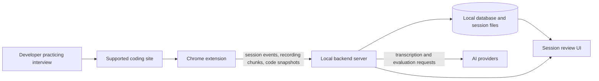
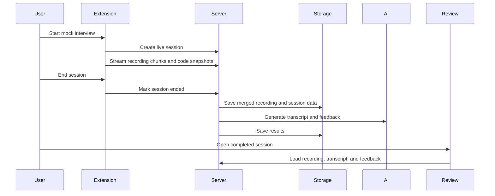

# InterviewCoach Design

This document gives a high-level view of InterviewCoach: what the major pieces are, how a live mock interview session flows through the system, and which technologies are used.

For product overview, screenshots, and installation steps, see the [README](../README.md).

## Overview

InterviewCoach is a local-first interview practice system for live mock coding interviews. A Chrome extension runs on supported coding challenge sites, starts a practice session, captures the browser tab, microphone audio, and editor snapshots, and sends that session data to a local backend server.

After the session ends, the backend prepares the recording, builds a transcript, runs AI-assisted evaluation, and stores the results for review. The user can then open the session history and review the video, transcript, code timeline, and feedback together.

## High-Level Architecture



### Chrome Extension

The Chrome extension is the user's entry point during practice. It detects supported coding pages, starts and stops mock interview sessions, records the active tab and microphone, captures editor snapshots, and opens the review experience.

### Local Backend Server

The backend receives live session data from the extension, stores session artifacts, merges recording chunks, extracts audio for transcription, coordinates AI-assisted feedback, and serves session results back to the extension UI.

### Local Storage

InterviewCoach stores session metadata, recordings, transcripts, code snapshots, and generated feedback locally. This keeps the practice workflow self-hosted and makes it easier for contributors to inspect and improve the pipeline.

### AI Integrations

AI providers are used for transcription, mock interview feedback, and evaluation workflows. Provider choice and API keys are configured locally through installer prompts or runtime configuration.

### Review UI

The review UI brings together the session recording, transcript, feedback, and code timeline so the user can understand what happened during the mock interview and what to improve.

## User Flow

1. The user installs the local server and loads the Chrome extension.
2. The user opens a supported coding problem.
3. The user starts a mock interview session from the extension.
4. The extension records tab video, microphone audio, and editor/code snapshots.
5. The user ends the session.
6. The backend processes the session and generates transcript plus feedback.
7. The user reviews the completed session in the extension's session history UI.

## Data Flow



## Main Components

### Extension Capture Layer

Responsible for starting sessions, capturing browser media, collecting editor snapshots, and showing the user controls for live practice.

| Part | Responsibility |
|------|----------------|
| Popup | Starts a mock interview session and opens session history. |
| Side panel | Owns active recording controls and capture status. |
| Content scripts | Run inside supported coding sites to collect the problem prompt and editor snapshots. |

Implementation notes:

- Extension code lives under `browser-extension/chrome/`.
- Active sessions send browser recording chunks, microphone/tab state, and periodic code snapshots to the local backend.
- Editor capture prefers platform/editor-specific detection where available, with fallbacks for common browser editor patterns.

### Live Session API Layer

Responsible for receiving session lifecycle events and raw capture data from the extension.

Key responsibilities:

- Create and track live mock interview sessions.
- Receive problem prompt updates from supported coding sites.
- Receive browser recording chunks during capture.
- Receive code/editor snapshots during capture.
- End the session and hand it off to post-session processing.
- Serve session history, session details, and merged recording playback.

Implementation notes:

- Session APIs are implemented in the server live-session modules.
- The browser streams capture data as it happens.
- The backend owns session metadata, artifact storage, and processing lifecycle.

### Post-Session Processing Layer

Responsible for turning raw session capture into reviewable artifacts: a playable recording, transcript, feedback, and timeline data.

After the session ends, the server combines the raw capture data into the artifacts used by the review UI.

| Stage | What Happens | Output |
|-------|--------------|--------|
| Merge recording | Uploaded browser chunks are merged into a playable WebM. | Session recording |
| Extract audio | FFmpeg/ffprobe prepare audio for transcription. | Audio input for STT |
| Build transcript | Speech is converted into timestamped transcript segments. | Transcript timeline |
| Prepare context | Problem prompt and code snapshots are aligned with the session timeline. | Evaluation context |
| Run evaluator | Feedback is generated from transcript, prompt, and code timeline. | Structured interview feedback |
| Save result | Recording, transcript, timeline, and feedback are persisted. | Reviewable session result |

#### Evaluator Agent

The evaluation step can run as a direct LLM evaluation or as a single tool-calling evaluator agent, depending on local configuration.

| Input / Tool | Purpose |
|--------------|---------|
| `get_session_metadata` | Reads session status, linked job, and capture counts. |
| `get_question` | Reads the stored interview problem or prompt. |
| `get_code_at` | Reads the editor snapshot at or before a timestamp. |
| `get_code_progression_in_timerange` | Reads code snapshots across a time window. |
| `get_transcription_in_timerange` | Reads transcript segments across a time window, optionally filtered by speaker. |

Agent notes:

- The single-agent evaluator is implemented with LangChain tool calling.
- The agent receives session/job identifiers and retrieves interview content through read-only tools.
- Tool times use seconds from the recording start; feedback timestamps are converted into milliseconds for review evidence.
- Provider selection is configured locally and can use hosted providers or local-model-compatible options.
- The output is structured feedback focused on strengths, weaknesses, important moments, and practical improvement notes.

### Persistence Layer

Responsible for keeping session records, generated results, and local artifacts available for later review.

Prisma and SQLite store structured metadata such as sessions, processing state, transcripts, code snapshots, and generated result references. Larger artifacts such as recording chunks, merged recordings, transcripts, and processing outputs are stored on disk under the server data directory.

This split keeps database records queryable for the review UI while avoiding large media blobs inside the database.

### Review UI

Responsible for helping the user inspect a completed mock interview.

The review UI loads session history and completed results from the local backend. It presents the recording, transcript, feedback, and code timeline together so the user can replay the session and connect feedback to the actual interview moment.

## Tech Stack

| Area | Technology |
|------|------------|
| Browser extension | Chrome Extension Manifest V3, TypeScript |
| Backend runtime | Node.js, TypeScript |
| HTTP server | Fastify |
| Database | Prisma, SQLite |
| Media processing | FFmpeg, ffprobe |
| AI integrations | OpenAI, Anthropic, Gemini, Ollama-compatible local models |
| Speech transcription | Local Whisper workflow and provider-backed options |
| Installers | Shell installer for macOS/Linux, PowerShell installer for Windows |
| Session review | Extension-hosted UI backed by the local server |

## APIs

The backend exposes a small HTTP API for the Chrome extension and review UI. The API is local-first and centered around live practice sessions.

| Area | API | Purpose | Used By |
|------|-----|---------|---------|
| Live sessions | `POST /api/live-sessions` | Create a live mock interview session. | Extension popup |
| Live sessions | `PATCH /api/live-sessions/:id` | Attach or update the coding problem/prompt for the session. | Extension content script |
| Live sessions | `POST /api/live-sessions/:id/video-chunk` | Upload browser recording chunks from the active session. | Extension side panel |
| Live sessions | `POST /api/live-sessions/:id/code-snapshot` | Upload periodic editor/code snapshots during practice. | Extension content script |
| Live sessions | `POST /api/live-sessions/:id/end` | End the session and trigger post-session processing. | Extension side panel |
| Live sessions | `GET /api/live-sessions` | List recent sessions for history and review. | Review UI |
| Live sessions | `GET /api/live-sessions/:id` | Fetch session metadata, status, and linked processing result. | Review UI |
| Live sessions | `GET /api/live-sessions/:id/recording.webm` | Stream the merged session recording for playback. | Review UI |
| Interview results | `GET /api/interviews/:id` | Poll processing status and fetch transcript, feedback, and timeline results. | Review UI |

The extension also keeps local runtime configuration for the backend URL and provider settings. API keys and provider choices remain local to the user's machine.

## Runtime Configuration Structure

Most users configure InterviewCoach through the installer. At runtime, the system needs:

- A running local backend server.
- The Chrome extension loaded in the browser.
- FFmpeg/ffprobe available for media processing.
- At least one configured AI provider or local model path for the chosen workflow.
- API keys kept in local config files and never committed to git.

Runtime config is stored as a versioned JSON object. Defaults live in `server/.app-runtime-config.defaults.json`, example values live in `server/.app-runtime-config.example.json`, and local overrides can be written to `server/.app-runtime-config.json`.

| Config Area | Example Keys | Purpose |
|-------------|--------------|---------|
| Versioning | `version` | Identifies the runtime config schema version. |
| Server binding | `listenHost`, `listenPort` | Controls where the local backend listens. |
| Evaluation mode | `evaluationProvider` | Chooses direct LLM evaluation or the single-agent evaluator. |
| LLM provider | `llmProvider`, `openaiModelId`, `anthropicModelId`, `geminiModelId`, `ollamaModelId`, `ollamaBaseUrl` | Selects the model used for feedback/evaluation. |
| API keys | `openaiApiKey`, `anthropicApiKey`, `geminiApiKey` | Stores local provider credentials. |
| Live realtime interview | `liveRealtimeProvider`, `openaiRealtimeModel`, `openaiRealtimeVoice`, `geminiLiveModel`, `geminiLiveVoice` | Configures the realtime voice/mock interview provider. |
| Speech transcription | `whisperModel`, `localWhisperExecutable` | Configures local Whisper transcription. |
| Option lists | `openaiEvalModelOptions`, `geminiLiveModelOptions`, `whisperModelOptions` | Provides model/voice choices shown by configuration UI. |
| Database | `databaseUrl` | Optional database connection override. |

Example shape:

```json
{
  "version": 1,
  "listenHost": "127.0.0.1",
  "listenPort": "3001",
  "evaluationProvider": "single-agent",
  "llmProvider": "gemini",
  "geminiModelId": "gemini-2.5-flash",
  "liveRealtimeProvider": "gemini",
  "geminiLiveModel": "gemini-2.0-flash-live-001",
  "geminiLiveVoice": "Puck",
  "whisperModel": "base",
  "localWhisperExecutable": "/path/to/whisper"
}
```

The public app config API exposes safe configuration state to the extension, such as selected models and whether keys are configured. It does not return raw secrets.


